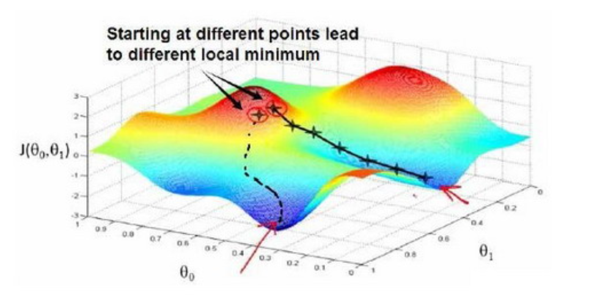
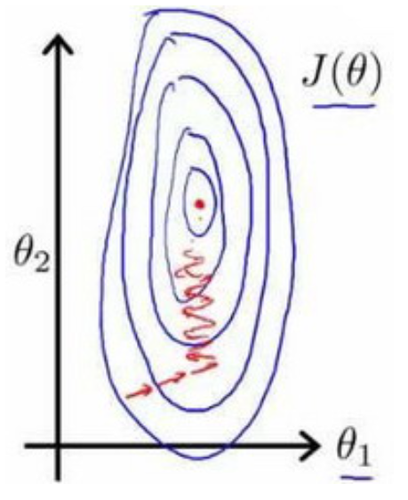
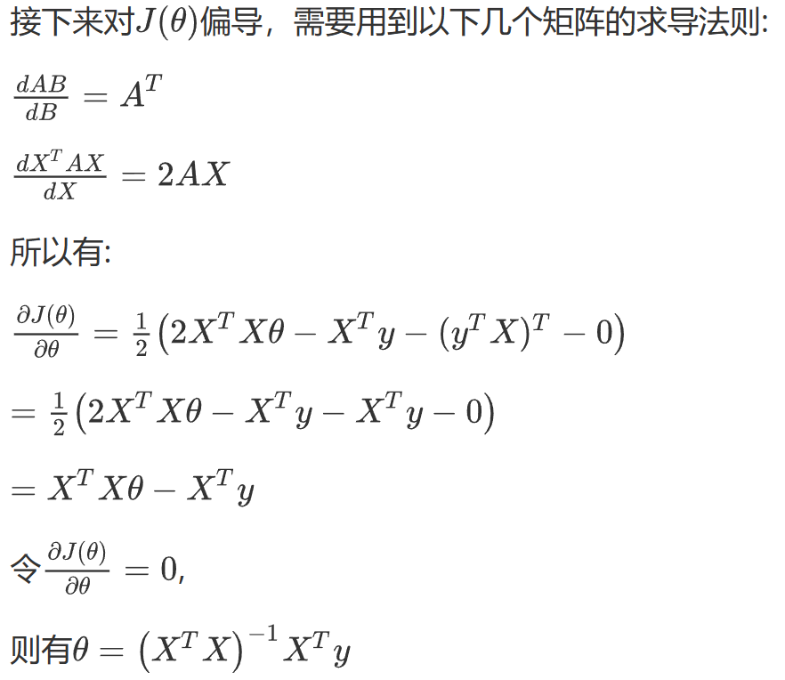
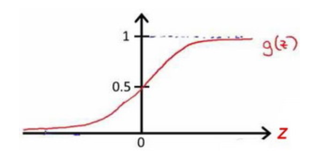
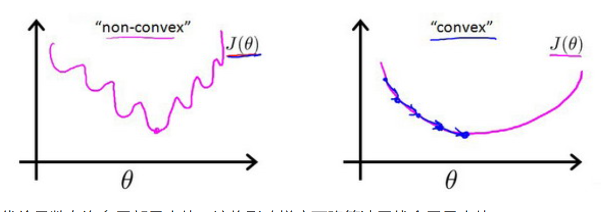
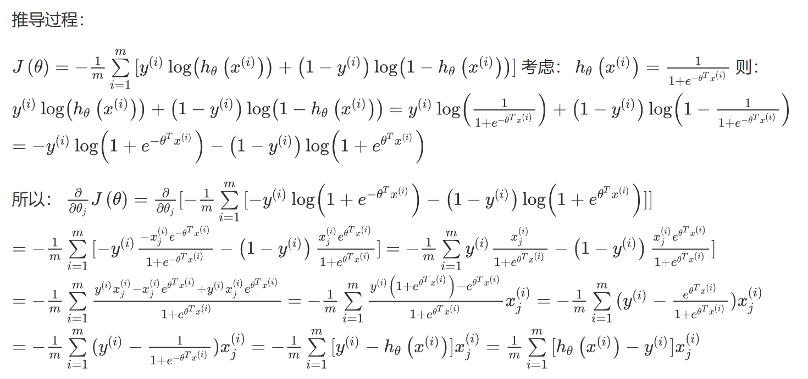
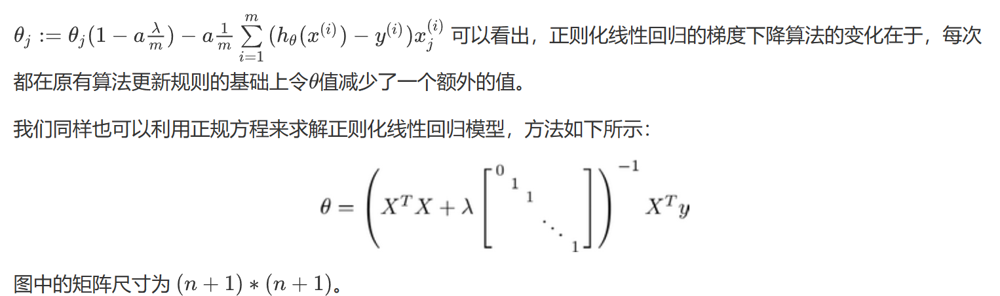
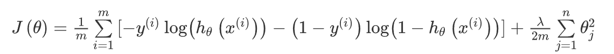

## ***<u>一、线性回归</u>***

### ***1.1 单变量线性回归***

$$
h_\theta = \theta_0+\theta_1x
$$

为了求出参数，目标是求出使得**建模误差**(模型预测值与训练集实际值之间的差距)的平方和最小的模型参数。

平方误差代价函数：
$$
\min_{\theta_0,\theta_1} J(\theta_0,\theta_1)=\min_{\theta_0,\theta_1}\frac{1}{2m}\sum_{i=1}^m (h_\theta(x^{(i)})-y^{(i)})^2
$$
求解该函数的算法：梯度下降（迭代算法，适合数据量大），正规方程法（normal equations 直接求数值解）

**· 梯度下降法**



开始时，随机选择一个参数组合()，寻找下一个使得代价函数值下降最多的参数组合，直至遇到局部最小值。
$$
\theta_j:=\theta_j-\alpha \frac{ \partial J(\theta_0,\theta_1) }{ \partial \theta_j }，(j = 0或1)
$$
α是学习率，求导相当于是该点的斜率

·α太小，很多步才能到达最低点

·α太大，可能越过最低点

·假设将θ放到局部最低点，那么下一步是不变，因为求导为0.  **故可解释为什么该算法可以收敛。**

批量梯度下降：梯度下降的每一步中，都用到了所有的训练样本，因为求导的时候，是求和


### ***1.2 线性代数知识回顾***

·矩阵和向量   向量是特殊的矩阵，一般指列向量

·矩阵乘法   不可交换律，可结合律

·单位矩阵I 主对角线上是1，其余全是0  

·逆，转置 
$$
AA^{-1}=I \\
（A×B）^T=B^T×A^T
$$

### ***1.3 多变量线性回归***

一般把Θ和X这种，都当成是列向量，所以Θ要转置。
$$
h_\theta(x)=\theta_0x_0+\theta_1x_1+...+\theta_nx_n = \theta^TX\\
\min_{\theta} J(\theta)=\min_{\theta}\frac{1}{2m}\sum_{i=1}^m (h_\theta(x^{(i)})-y^{(i)})^2\\
\theta_j:=\theta_j-\alpha \frac{ \partial J(\theta) }{ \partial \theta_j }，(j = 0,1,..,n)\\
↓\\
\theta_j:=\theta_j-\alpha \frac{1}{m}\sum_{i=1}^m(h_\theta(x^{(i)})-y^{(i)})x_j^{(i)}，(j = 0,1,..,n)
$$

```python
def computeCost(X, y, theta):
    inner = np.power(((X * theta.T) - y), 2)
    return np.sum(inner) / (2 * len(X))
```

·特征缩放

​    为了帮助梯度下降法更快收敛，需要对特征的值进行缩放。
​    如特征1的值是0~2000，特征2的值是0~5，那么可以以二者为x，y轴画一个J(θ)的等高线，会发现图像很扁，收敛较慢



​    故需要将特征值缩到-1~1之间，
$$
x_n=\frac{x_n-\overline{x}}{s_n},s_n为标准差
$$
·学习率

   可绘制损失函数与迭代次数的图表查看收敛；
   或者设定函数值与阈值差距
   通常考虑设定α为0.01 0.03 0.1 0.3 1 3 10


### ***1.4 特征与多项式回归***

根据数据情况判断
$$
h_\theta(x)=\theta_0+\theta_1x_1+\theta_2\sqrt{x_3}
$$

### ***1.5 正规方程法***

对于某些线性回归问题，要求：矩阵可逆

**矩阵不可逆**通常是指 那些特征之间并不独立，或者 特征数量>>样本数量
$$
J(\theta)=a\theta^2+b\theta+c\\
求\frac{\partial J(\theta_j)}{\partial \theta_j} = 0\\
得\theta=(X^TX)^{-1}X^Ty\\
推导过程：(X是m行n列，\theta是n行1列)\\
J(\theta)=\min_{\theta}\frac{1}{2m}\sum_{i=1}^m (h_\theta(x^{(i)})-y^{(i)})^2\\
J(\theta)=\frac{1}{2}(X\theta-y)^2=\frac{1}{2}(X\theta-y)^T(X\theta-y)\\
=\frac{1}{2}(\theta^TX^TX\theta-\theta^TX^Ty-y^TX\theta-y^Ty)
$$



| 梯度下降                   | 正规方程                                                     |
| :------------------------- | :----------------------------------------------------------- |
| 需要选择学习率             | 不需要                                                       |
| 需要多次迭代               | 一次运算得出                                                 |
| 当特征数量大时也能较好适用 | 需要计算$$（X^T X）^{-1}$$ 如果特征数量n较大则运算代价大，因为矩阵逆的计算时间复杂度为O($$n^3$$)，通常来说当小于10000 时还是可以接受的 |
| 适用于各种类型的模型       | 只适用于线性模型，不适合逻辑回归模型等其他模型               |

```python
import numpy as np
 def normalEqn(X, y):
   theta = np.linalg.inv(X.T@X)@X.T@y #X.T@X等价于X.T.dot(X)
   return theta
```

pinv即使矩阵不可逆也能计算(伪逆)

在发现矩阵不可逆时：

·寻找特征之间相关性，考虑只保留重复特征中的一个

·正则化技术：即使小数据样本，也能找多特征的参数

### ***1.6 code***

单变量线性回归：

​    查看数据样子->代价函数计算，输入矩阵X，y，theta，查看函数值

​	      ->批量梯度下降法，输入矩阵X,y,theta,alpha,迭代次数 -> 绘制图形，查看拟合情况； 绘制迭代图

多变量线性回归：

​    预处理步骤：特征归一化 -> 批量梯度下降法 同上

​		        -> scikt_learn的线性回归函数

​                       -> 正规方程法

## ***<u>二、逻辑回归</u>***

### ***2.1 定义***

输出值永远是0~1之间，
$$
令h_\theta(x)=sigmoid(\theta^Tx)=\frac{1}{1+e^{-\theta^Tx}}\\
h_\theta(x)>=0.5, y=1\\
h_\theta(x)<0.5, y=0\\
即h_\theta(x)=P(y=1|x;\theta)，在x和\theta的作用下，y=1的概率
$$

```python
import numpy as np
def sigmoid(z):
   return 1 / (1 + np.exp(-z))
```



### ***2.2 分类边界*** 

绘制  $$\theta^Tx=0$$ 的图像，但仅适合线性的数据
$$
由sigmoid图像可知，\\
\theta^Tx>0，h_\theta(x)>0.5，则y=1\\
\theta^Tx<0，h_\theta(x)<0.5，则y=0
$$

### ***2.3 代价函数***

如何确定$$\theta$$的取值？ 

如果还是采用误差的平方和，带入到函数中，得到的是一个非凸函数，**即在梯度下降算法中，很容易局部最小值。**



·引入对数方法：
$$
J(\theta)=\frac{1}{m}\sum_{i=1}^mCost(h_\theta(x^{(i)}),y^{(i)})\\
Cost(h_\theta(x),y)=-log(h_\theta(x))，if\ y=1\\
=-log(1-h_\theta(x)),if\ y=0\\
即Cost(h_\theta(x^{(i)}),y^{(i)})=-y^{(i)}log(h_\theta(x^{(i)}))-(1-y^{(i)})log(1-h_\theta(x^{(i)}))
$$
当y=1，且$$h_\theta(x)=1$$，则误差为0

当y=1，且$$h_\theta(x)\ne1$$，随着$$h_\theta(x)$$的变小，误差会变大

当y=0，且$$h_\theta(x)=0$$，则误差为0

当y=0，且$$h_\theta(x)\ne0$$，随着$$h_\theta(x)$$的变大，误差会变大

```python
import numpy as np
def cost(theta, X, y):
  theta = np.matrix(theta)
  X = np.matrix(X)
  y = np.matrix(y)
  first = np.multiply(-y, np.log(sigmoid(X* theta.T)))
  second = np.multiply((1 - y), np.log(1 - sigmoid(X* theta.T)))
  return np.sum(first - second) / (len(X))
```

·梯度下降法求解，要先进行特征缩放(即归一化)
$$
\theta_j:=\theta_j-\alpha \frac{ \partial J(\theta) }{ \partial \theta_j }=\theta_j-\alpha \frac{1
}{m}\sum_{i=1}^m[h_\theta(x^{(i)})-y^{(i)})]x_j^{(i)}
$$
对于该凸函数的求解，考虑似然函数。 **发现该式子和线性回归的代价函数一样**



### ***2.4 高级优化***

​    提高逻辑回归的分类速度，解决大型机器学习问题

无需设置学习率$$\alpha$$

·共轭梯度BFGS（变尺度法）


·L-BFGS（限制变尺度法）

### ***2.5 多分类***

每个类别单独做二分类，然后选择该样本的$$h_\theta(x)$$最高的那个类别

### ***2.6 正则化***

**过拟合问题**：代价函数几乎为0，训练集训练得好，但是预测新数据效果可能很差

解决方法：

·丢弃一些特征，或者采用PCA

**·正则化，保留所有特征，减少参数大小**
$$
h_\theta(x)=\theta_0+\theta_1x_1+\theta_2x_2^2+\theta_3x_3^3+\theta_4x_4^4
$$
​    高次项产生过拟合，若让高次项的系数接近0，则可较好拟合。

​    修改代价函数，为系数添加惩罚项，若不知道要对哪些惩罚，可让软件自动优化选择
$$
J(\theta) = \frac{1}{2m}[\sum_{i=1}^m(h_\theta(x^{(i)})-y^{(i)})^2+\lambda\sum_{j=1}^n\theta_j^2]
$$
若$$\lambda$$过大，则会使所有参数都过于小，导致$$h_\theta(x)=\theta_0$$，造成欠拟合。

·正则化线性回归



·正则化逻辑回归



```C++
import numpy as np

def costReg(theta, X, y, learningRate):
    theta = np.matrix(theta)
    X = np.matrix(X)
    y = np.matrix(y)
    first = np.multiply(-y, np.log(sigmoid(X*theta.T)))
    second = np.multiply((1 - y), np.log(1 - sigmoid(X*theta.T)))
    reg = (learningRate / (2 * len(X))* np.sum(np.power(theta[:,1:theta.shape[1]],2))
    return np.sum(first - second) / (len(X)) + reg
```

### ***2.7 code***

· 逻辑回归

  查看数据样子(散点图) -> sigmoid函数，代价cost函数，训练集设置(X,y)，批量梯度下降函数gradient，

​			scipy.optimize的TNC寻找最优参数，得到参数theta

```python
import scipy.optimize as opt
result = opt.fmin_tnc(func=cost, x0=theta, fprime=gradient, args=(X, y))
```

输入参数theta，预测函数predict，算Accuracy

```python
def predict(theta, X):
    probability = sigmoid(X * theta.T)
    return [1 if x >= 0.5 else 0 for x in probability]
```


· 正则化逻辑回归

   查看数据样子(散点图)，发现没有线性边界 -> 正则化代价函数costReg

```python
def costReg(theta, X, y, learningRate):
    theta = np.matrix(theta)
    X = np.matrix(X)
    y = np.matrix(y)
    first = np.multiply(-y, np.log(sigmoid(X * theta.T)))
    second = np.multiply((1 - y), np.log(1 - sigmoid(X * theta.T)))
    reg = (learningRate / (2 * len(X))) * np.sum(np.power(theta[:,1:theta.shape[1]], 2))
    return np.sum(first - second) / len(X) + reg
```

并没有对$$\theta_0$$进行正则化，梯度下降时要单独算。

```python
def gradientReg(theta, X, y, learningRate):
    theta = np.matrix(theta)
    X = np.matrix(X)
    y = np.matrix(y)
    
    parameters = int(theta.ravel().shape[1])
    grad = np.zeros(parameters)
    
    error = sigmoid(X * theta.T) - y
    
    for i in range(parameters):
        term = np.multiply(error, X[:,i])
        
        if (i == 0):
            grad[i] = np.sum(term) / len(X)
        else:
            grad[i] = (np.sum(term) / len(X)) + ((learningRate / len(X)) * theta[:,i])
    
    return grad
```

直接用scikit-learn

```python
from sklearn import linear_model#调用sklearn的线性回归包
model = linear_model.LogisticRegression(penalty='l2', C=1.0)
model.fit(X2, y2.ravel())
```


## <u>***三、神经网络***</u>

### ***3.1 非线性假设***

​    当特征数量非常多时，如识别视觉对象，采用图片的像素点作为特征(如果是灰度图片，则一个像素就只有一个值(而非RGB))，为了有效处理那么多特征，则需要采用神经网络。

### ***3.2 模型表示***

·神经元：多个输入，一个输出。  神经元接收输入的信息进行计算，传递给其他神经元


·x1,x2,x3为输入单元(输入层)，a1，a2，a3为中间单元(隐藏层)，负责处理数据，然后传递给下一层，最后是输出单元(输出层)，负责计算$$h_\theta(x)$$​。
$$
h_\theta(x)=g(\theta_0^{(2)}a_0^{(2)}+\theta_1^{(2)}a_1^{(2)}+\theta_2^{(2)}a_2^{(2)}+\theta_3^{(2)}a_3^{(2)})
$$
·每一层都添加一个偏置单位
$$
a_i^{(j)}表示第j层的第i个激活单元\\
\theta^{(j)}表示第j层映射到第j+1层时的权重矩阵(尺寸为：第j+1层的激活单元数为行数，第j层的激活单元数+1为列数)\\
$$
（每一个a都是由上一层的所有x和其对应的参数所决定）


这样从左到右的算法称为**前向传播算法**

向量化表示：


最后一层假设是逻辑回归，那么他的输入其实就是   $$\theta_0^{(2)}a_0^{(2)}+\theta_1^{(2)}a_1^{(2)}+\theta_2^{(2)}a_2^{(2)}+\theta_3^{(2)}a_3^{(2)}$$

**而实际的输入是x1，x2，x3，再附加一个x0，所以可见神经网络就是将这些x转化成更高级的特征a，同时这些特征又是被x所决定的。**

**又由于随着层数的增加，a是梯度变化的，且越变越厉害，也越能预测新数据，也就是神经网络相较逻辑回归和线性回归的优势。**

### ***3.3 特征的直观理解***

​     神经网络学习自身，得出了新的特征，如and 与 or 函数，而为了实现更复杂的运算，则可利用神经元来进行组合，即构造出越来越复杂的函数，得到更加厉害的特征值。

### ***3.4 代价函数***

$$
设样本数量为m，L表示神经网络层数，S_i表示第i层神经元个数\\
二分类：S_L=1，y=0或1\\
多分类：S_L=k，y_k=1则分到该类(k>2)
$$

由于我们的输出变量是一个k维的向量，故代价函数为：
$$
h_\theta(x)∈R^K \\
$$


对于每一行特征，会给出k个预测，选出可能性最高的一个。

对于正则化那一项，求每一层的Θ矩阵的和

最里层的j循环所有的行(由$$s_l$$+1层的激活单元数决定)，i循环所有的列(由$$s_l$$层的激活单元数决定)，l循环每一层。
$$h_\theta(x)$$与真实值的距离为 每个样本-每个类输出的加和

### ***3.5 反向传播算法***

首先计算最后一层的误差，然后再一层一层求出各层的误差。

误差是指激活单元的预测$$a^{(4)}$$与真实值y的误差：$$\xi^{(4)}=a^{(4)}-y$$

前一层的误差：$$\xi^{(3)}=(\theta^{(3)})^T\xi^{(4)}*g'(z^{(3)})$$

g'是sigmoid的导数 g*(1-g)

于是对于代价函数的偏导数有：
$$
\frac{\partial J(\theta)}{\partial \theta_{ij}^{(l)}}=a_j^{(l)}\xi_i^{l+1}\\
l代表计算第几层，j代表当前层的第j个单元，i代表下一层的误差单元下标
$$
·直观理解：

### ***3.6 梯度检验***

​    当我们对一个较为复杂的模型（例如神经网络）使用梯度下降算法时，可能会存在一些不容易察觉的错误，意味着，虽然代价看上去在不断减小，但最终的结果可能并不是最优解。

​    通过估计梯度值来检验我们计算的导数值是否真的是我们要求的。

​    对梯度的估计采用的方法是在代价函数上沿着切线的方向选择离两个非常近的点然后计算两个点对应的代价平均值用以估计梯度。
$$
即求出J(\theta-σ)，J(\theta+σ),求平均，用以估计J(\theta)
$$

### ***3.7 神经网络使用步骤***

1.选择网络结构 决定选择多少层以及决定每层分别有多少个单元。

2.第一层单元数：即训练集特征数量

  最后一层单元数：即结果的类的数量

3.训练神经网络步骤：

​	·参数的随机初始化	

​	·利用正向传播方法计算所有的$$h_\theta(x)$$

​	·编写计算代价函数J的代码

​	·利用反向传播方法计算所有偏导数

​	·利用数值检验方法检验这些偏导数

​	·使用优化算法来最小化代价函数	

### ***3.8 相关例子：自主驾驶***

**ALVINN** (**Autonomous Land Vehicle In a Neural Network**)是一个基于神经网络的智能系统

## ***<u>四、应用机器学习的建议</u>***

​    当我们运用训练好的模型来预测数据时，发现有较大的误差，下一步：

1. 获得更多的训练样本——通常是有效的，但代价较大，下面的方法也可能有效，可考虑先采用下面的几种方法。
2. 尝试减少特征的数量
3. 尝试获得更多的特征
4. 尝试增加多项式特征
5. 尝试减少正则化程度
6. 尝试增加正则化程度

​    要选哪一种？

**机器学习诊断法：**

### 4.1 评估假设函数：

  判断过拟合：

​	1.画图，但特征过多时画图很难。

​	2.数据洗牌，划分训练集和测试集(含各种类型的数据)，

​	    ·对于线性回归，利用测试集数据计算代价函数J

​	    ·对于逻辑回归，对于每一个测试集样本，计算误分类的比率


### 4.2 模型选择与交叉验证集

即：使用60%的数据作为训练集，使用 20%的数据作为交叉验证集，使用20%的数据作为测试集

1. 使用训练集训练出10个模型
2. 用10个模型分别对交叉验证集计算得出交叉验证误差（代价函数的值）
3. 选取代价函数值最小的模型
4. 用步骤3中选出的模型对测试集计算得出推广误差（代价函数的值）

 $J_{train}(\theta) = \frac{1}{2m}\sum_\limits{i=1}^{m}(h_{\theta}(x^{(i)})-y^{(i)})^2$

$J_{cv}(\theta) = \frac{1}{2m_{cv}}\sum_\limits{i=1}^{m}(h_{\theta}(x^{(i)}_{cv})-y^{(i)}_{cv})^2$

$J_{test}(\theta)=\frac{1}{2m_{test}}\sum_\limits{i=1}^{m_{test}}(h_{\theta}(x^{(i)}_{cv})-y^{(i)}_{cv})^2$​


### 4.3 诊断偏差与方差

偏差大，欠拟合

方差大，过拟合

​	**将训练集和交叉验证集的代价函数误差与多项式的次数绘制在同一张图表上来帮助分析**


对于训练集，当d较小时，模型拟合程度低，随着d变大，误差减小，拟合程度提高

**对于验证集，其转折点是模型开始过拟合训练数据集的时候。**

训练集误差与交叉验证集误差近似，偏差即欠拟合

交叉验证集的误差远大于训练误差，方差即过拟合


**·正则化与偏差/方差**

$$如何选择\lambda$$

1. 使用训练集训练出12个不同程度正则化($$\lambda=0,0.01,0.02,...,10$$)的模型

2. 用12个模型分别对交叉验证集计算的出交叉验证误差

3. 选择得出交叉验证误差**最小**的模型

4. 运用步骤3中选出模型对测试集计算得出推广误差，我们也可以同时将训练集和交叉验证集模型的代价函数误差与λ的值绘制在一张图表上：

   

• 当 $\lambda$ 较小时，训练集误差较小（过拟合）而交叉验证集误差较大

• 随着 $\lambda$ 的增加，训练集误差不断增加（欠拟合），而交叉验证集误差则是先减小后增加

### 4.4 学习曲线

学习曲线是将训练集误差和交叉验证集**误差**作为训练集样本**数量**（$m$）的函数绘制的图表。

帮助判断增加数据集样本数量，也可能对误差没有影响

### 4.5 诊断指南

1. 获得更多的训练样本——解决高方差
2. 尝试减少特征的数量——解决高方差
3. 尝试获得更多的特征——解决高偏差
4. 尝试增加多项式特征——解决高偏差
5. 尝试减少正则化程度λ——解决高偏差
6. 尝试增加正则化程度λ——解决高方差

```
通常选择较大的神经网络并采用正则化处理会比采用较小的神经网络效果要好。

对于神经网络中的隐藏层的层数的选择，通常从一层开始逐渐增加层数，为了更好地作选择，可以把数据分为训练集、交叉验证集和测试集，针对不同隐藏层层数的神经网络训练神经网络，
```

### 4.6 机器学习系统的设计

首先用一种简单的方法实现，然后画出学习曲线，接着就是做误差分析

构建一个学习算法的推荐方法为：

1. 从一个简单的能快速实现的算法开始，实现该算法并用**交叉验证集数据**测试这个算法

2.绘制学习曲线，决定是增加更多数据，或者添加更多特征，还是其他选择

3.进行误差分析：**人工检查**交叉验证集中我们算法中产生预测误差的样本，看看这些样本是否有某种系统化的趋势

### 4.7 数据不平衡时的误差度量

1.**正确肯定**（**True Positive,TP**）：预测为真，实际为真

2.**正确否定**（**True Negative,TN**）：预测为假，实际为假

3.**错误肯定**（**False Positive,FP**）：预测为真，实际为假

4.**错误否定**（**False Negative,FN**）：预测为假，实际为真

查准率（Precision）：**TP/(TP+FP)  **  在所有我们预测有恶性肿瘤的病人中，实际上有恶性肿瘤的病人的百分比，越高越好。

查全率（Recall）：**TP/(TP+FN)**  在所有实际上有恶性肿瘤的病人中，成功预测有恶性肿瘤的病人的百分比，越高越好。

```
假使，我们的算法输出的结果在0-1 之间，我们使用阀值0.5 来预测真和假。
```

​    如果我们希望只在**非常确信的情况下预测为真**（肿瘤为恶性），即我们希望**更高的查准率**，我们可以使用比0.5更大的阀值，如0.7，0.9。这样做我们会减少错误预测病人为恶性肿瘤的情况，同时却会增加未能成功预测肿瘤为恶性的情况。

​    如果我们希望**提高查全率**，**尽可能地让所有有可能是恶性肿瘤的病人都得到进一步地检查、诊断**，我们可以使用比0.5更小的阀值，如0.3。

​    我们可以将不同阀值情况下，查全率与查准率的关系绘制成图表，曲线的形状根据数据的不同而不同：


我们希望有一个帮助我们选择这个阀值的方法。一种方法是计算**F1 值**（**F1 Score**），其计算公式为：
$$
F1=2*\frac{P*R}{P+R}
$$
我们选择使得**F1**值最高的阀值。

### 4.8 机器学习的数据

因此偏差问题，我们将通过确保有一个具有很多参数的学习算法来解决，以便我们能够得到一个较低偏差的算法，并且通过用非常大的训练集来保证。

## ***<u>五、SVM支持向量机</u>***

